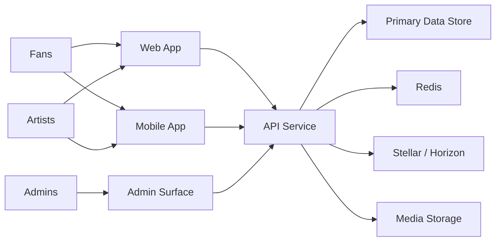

# MVP System Context

This document describes the current MVP system context for Chordially and defines the bounded contexts contributors should treat as the primary architectural seams.

## System Context Diagram

## Primary Actors

- Fans discover live sessions, join them, and send tips.
- Artists manage profiles, start sessions, and monitor earnings.
- Admins moderate users, sessions, and transactions.

## Bounded Contexts

### Identity and Access

- registration, login, session validation, role enforcement
- owned primarily by API and consumed by web, mobile, and admin surfaces

### Artist Profile

- public performer identity, profile media, onboarding state, payout readiness
- consumed by discovery, session, and admin contexts

### Live Session

- draft, scheduled, live, paused, ended session lifecycle
- exposes live status and runtime metrics to clients and admin tooling

### Realtime Interaction

- viewer presence, activity feeds, reactions, leaderboards, moment updates
- built on Redis-backed fanout and client subscriptions

### Payments and Settlement

- tip intents, transaction preparation, verification, settlement, earnings aggregation
- integrates with Stellar but exposes stable product-level state internally

### Discovery and Growth

- live feed ranking, personalization, badges, streaks, and supporter identity surfaces
- consumes artist, session, and payment signals but should remain read-optimized

### Admin Operations

- moderation, transaction review, audit queries, and operational overrides
- must remain isolated from consumer-facing mutation flows

## Context Boundaries

- Shared types belong in `packages/types`.
- External-provider specifics should stay behind service adapters in package or app internals.
- Cross-context interactions should happen through stable API contracts or documented domain events rather than direct file reuse.
